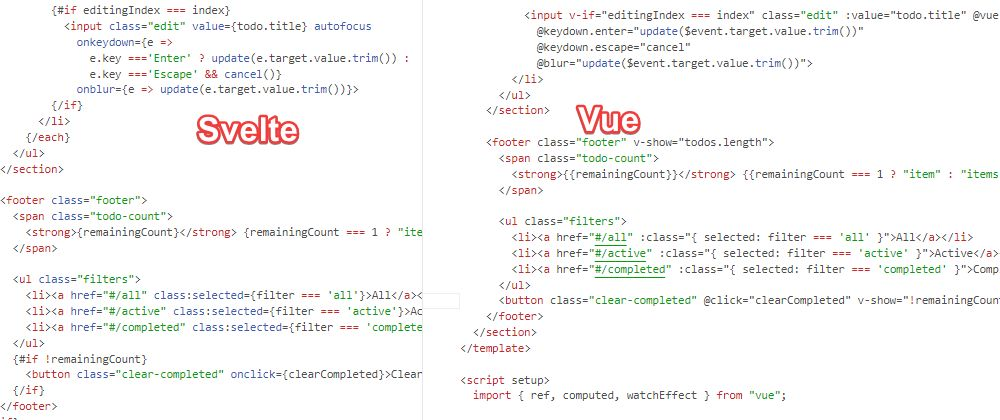

# Line-Perfect Comparison of TodoMVC apps

Like [todomvc.com](https://todomvc.com/), but focusing on making the code as similar as possible.

Also trying to keep DOM code with the HTML. I'm not sure how useful this is, but some frameworks offer some added sugar for HTML.

## Frameworks
- [React(TODO)](react/src/App.jsx)
- [Solid(90%)](solid/src/App.jsx)
- [Vue(100%)](vue/src/App.vue)
- [Svelte(100%)](svelte/src/App.svelte)

[Contributing](https://github.com/icetbr/my-projects/blob/main/CONTRIBUTING.md)\
[License (MIT)](https://choosealicense.com/licenses/mit/)
